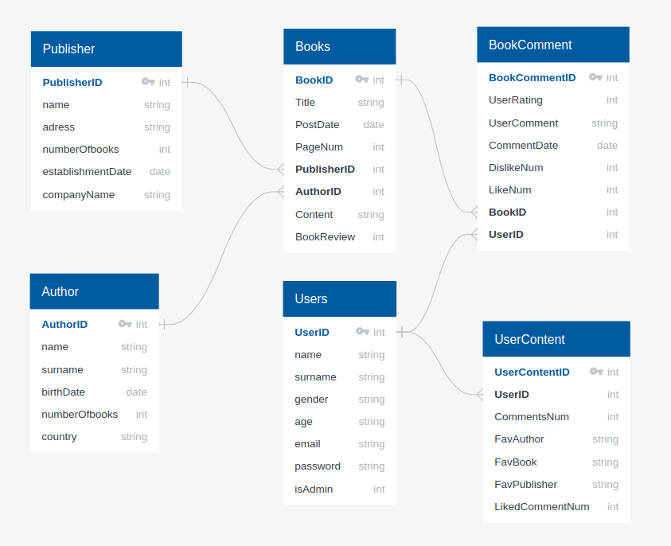

Developer Guide
===============

WOB's Database Design
---------------------

Our Website's background consists of 6 main tables.
We designed the tables for Users which easily see books with deep details,
see publishers and authors information, add comments to the books, vote on books,
register to the website and portable profile information that changeable and deletable.
While providing these features, we have linked the tables in an effective and logical framework.
Structure (E/R Diagram) shown below.

.. toctree::

     member1
     member2

